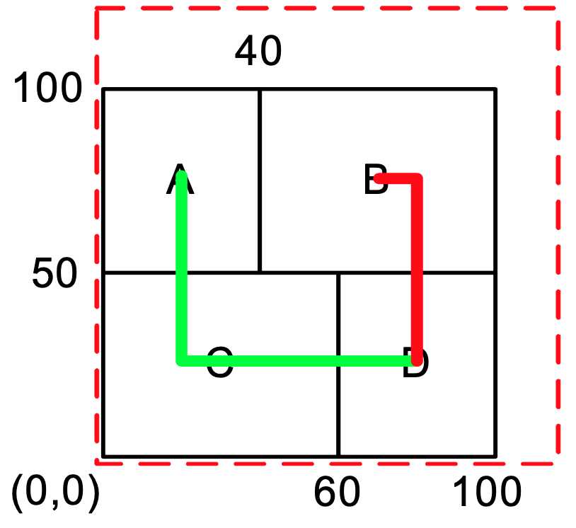

# Fixed-outline Floorplanning

Due: 10/26 23:59 PM

## Problem Description

This programming assignment asks you to write a fixed-outline chip floorplanner that can handle hard macros. Given a set of rectangular macros and a set of nets, the floorplanner places all macros within a rectangular chip without any overlaps. We assume that the lower-left corner of this chip is the origin (0,0), and no space (channel) is needed between two different macros. The objective is to minimize the area of chip bounding box and the total net wirelength. The total wirelength $W$ of a set of nets $N$ can be computed by:

$$
W = \sum_{n_i \in N} HPWL(n\_i)
$$

where HPWL denotes the half-perimeter wirelength, i.e., half of bounding box length, of net $n_i$. The objective for this problem is to minimize:

$$
Cost = \alpha A/A_{norm} + (1 - \alpha) W/W_{norm}
$$

where $A$ denotes the bounding-box area of the floorplan, Anorm is the average area, $W$ is the total wire length, Wnorm is the average wire length, and $\alpha$, $0 ≦ \alpha ≦ 1$, is a user defined ratio to balance the final area and wirelength. To compute $A_{norm}$ and $W_{norm}$, we can perturb the initial solution $m$ times to obtain $m$ floorplans and compute the average area $A_{norm}$ and the average wire length $W_{norm}$ of these floorplans. The value $m$ is proportional to the problem size. 

Note that a floorplan which cannot fit into the given outline is not acceptable.

## Input

Each test case has two input files, input.block and input.nets. The first file (input.block) gives the outline size, the number of blocks, and the number of terminals defined in this file. Then the block dimensions are listed, followed by the terminal locations. The file format is as follows:

```text
Outline: <outline width, outline height> 
NumBlocks: <# of blocks> 
NumTerminals: <# of terminals>
<macro name> <macro width> <macro height> 
... More macros
<terminal name> terminal <terminal x coordinate> <terminal y coordinate> 
... More terminals
```

The second file gives the number of nets in the floorplan, followed by the terminal information for each net. The file format is as follows:

```text
NumNets: <# of nets>
NetDegree: <# of terminals in this net> <terminal name>
... More terminal names
... More “NetDegree” and “terminal name”
```

The user-defined ratio α is given through the command-line argument. It ranges between 0 and 1.

## Output

The output file (output.rpt) records the problem output. This report consists of six parts: 
  1. The final cost
  2. The total wirelength
  3. The chip area
  4. The chip width and height
  5. The runtime in seconds
  6. The bounding-box coordinate for each macro (specified by the lower-left corner and upper-right corner). 

The report file format is shown below:


```text
<final cost>                     // Cost 
<total wirelength>               // W
<chip_area>                      // area = (chip_width) * (chip_height)
<chip_width> <chip_height>       //resulting chip width and height
<program_runtime>                //report the runtime in seconds
<macro_name> <x1> <y1> <x2> <y2> 
<macro_name> <x1> <y1> <x2> <y2> // (x1, y1): lower-left corner, (x2, y2): upper-right corner 
... More macros
```

## Example

Consider the following example of four blocks (`A`, `B`, `C`, and `D`) and two nets (`A, C, D` and `B, D`):

```text
# input.block
Outline: 120 120 
NumBlocks: 4 
NumTerminals: 0 
A 40 50
B 60 50 
C 60 50 
D 40 50
```

```text
# input.nets
NumNets: 2 
NetDegree: 3 
A
C
D 
NetDegree: 2 
B
D
```

An example floorplan output is as follows:

```
5085 
170 
10000 
100 100 
0.24
A 0 50 40 100 
B 40 50 100 100 
C 0 0 60 50 
D 60 0 100 50
```




## Language

You can implement this assignment using any language you like. However, we recommend `C` or `C++` for performance reason.

## Platform

You need to evaluate your program on the Linux server at `twhuang-server-01.ece.utah.edu`.

Please email Dr. Huang (tsung-wei.huang at utah.edu) for creating an account to log in.


## Program Command 

Your program should support the following command-line parameters:

```bash
[executable file name] [α value] [input.block name] [input.net name] [output file name]
```

For example:

```bash
~$ ./floorplanner 0.5 input.block input.nets result.rpt
```

## Checker 

We have also provide a checker program for you to verify your program:

```bash
~$ ./checker/checker_linux benchmark_name_only [your output file name]
```

For example, assume you want to verity the benchmark `ami33`:

```bash
~$ ls
input_pa2 README.md checker
~$ ./checker/checker.py ami33 ami33.rpt  
```

A successful verification will give you the following message:

```bash
######################################################################
           input: ami33
   num of blocks: 33
num of terminals: 40
     num of nets: 121
            area: 1281056
 area difference: 0.0
            hpwl: 118706.0
 hpwl difference: 0.0
      total cost: 699881.0
            SAME
           LEGAL
        IN BOUND
######################################################################
```

Note the above output is just an example. The name two lines tell if your result is legal.


## Submission

You need to submit a report by responding directly to [Programming Assignment #2 Submission Page](https://github.com/tsung-wei-huang/ece5960-physical-design/issues/3). The report should contain the following section:

+ A section describing means to compile and run your code 
+ A section listing partition results in terms of cut size and runtime for each *PASSED* benchmark 
+ A section outlining the challenges you encountered and solved during the implementation

You *DO NOT* need to submit any source code but place it under the folder `/home/your_account/PA2` in the server `twhuang-server-01.ece.utah.edu`, where `your_account` is your log-in account. The instructor will go to your folder to grade your code based on the instruction in your report. If you wish to place your code somewhere else, please document it in your report.

To help you stay on schedule, we will have two checkpoints. At each checkpoint, you will need to update your current results in a Markdown Table by responding to [Programming Assignment #2 Checkpoint Report](https://github.com/tsung-wei-huang/ece5960-physical-design/issues/4).


## Grading Policy

This programming assignment will be graded based on the following metrics:

+ Correctness reported by the checker program
+ Solution quality of your partitioned results
+ Runtime performance of your program

## Academic Integrity

Please refer to the [University Academic Policies](https://regulations.utah.edu/academics/) for details about academic integrity.

## Questions

If you have any questions, please create an [issue page](https://github.com/tsung-wei-huang/ece5960-physical-design/issues). We highly encourage you discuss questions with others in the issue page.
